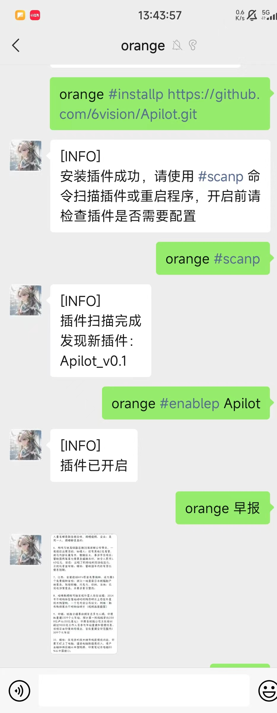
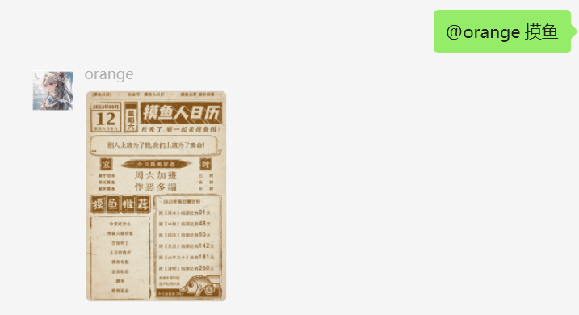
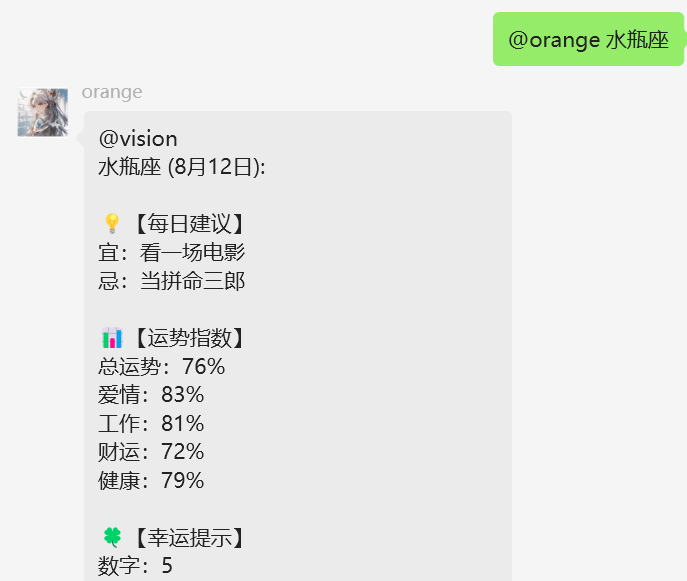

## 一个基于[ChatGPT-on-Wechat](https://github.com/zhayujie/chatgpt-on-wechat)项目的简单插件，直接调用一些实用的api接口！

### 安装

使用管理员口令在线安装即可，参考这里去如何[认证管理员](https://www.wangpc.cc/aigc/chatgpt-on-wechat_plugin/)！

```
#installp https://github.com/6vision/Apilot.git
```

安装成功后，根据提示使用`#scanp`命令来扫描新插件，再使用`#enablep Apilot`开启插件，参考下图



### 配置
直接安装不配置也可以使用一部分接口，部分接口(快递、天气)需要配置alapi的token。

复制插件目录的`config.json.template`文件并重命名为`config.json`，在`alapi_token`字段填入申请的token，token申请点击这里[alapi](https://admin.alapi.cn/account/center)

### 使用
* 对话框发送“早报”、“摸鱼”、"微博热搜"、”任意星座名称”可以直接返回对应的内容！

  







* 快递查询格式：快递+快递编号。如：快递YT2505082504474，如下图!

  


* 天气查询格式：城市+天气。如：成都天气。（支持3400+城市天气，输入不正确或者查询失败返回北京天气）


